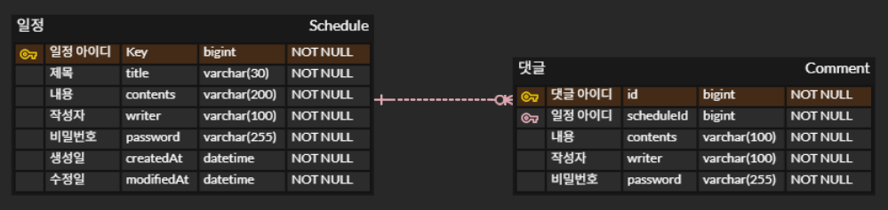

# 🗓️ 일정 관리 API

간단한 일정 관리 기능을 제공하는 Spring Boot 기반 RESTful API입니다.  
일정 CRUD 및 댓글 작성, 입력값 유효성 검증 기능 등을 포함합니다.

---

## ✅ 기능 요약

| 기능         | 설명                           |
|------------|------------------------------|
| 일정 생성      | 일정 등록 (제목, 내용, 작성자명, 비밀번호)   |
| 일정 전체 조회  | 전체 조회                        |
| 일정 단건 조회  | 단건 조회 (댓글 포함)                |
| 일정 수정      | 일정 제목 및 작성자명 수정 (비밀번호 검증 포함) |
| 일정 삭제      | 일정 삭제 (비밀번호 검증 포함)           |
| 댓글 생성      | 일정에 댓글 등록, 최대 10개 제한         |

---

## 📚 기능 상세

### 📌 Lv 1. 일정 생성

- 일정 작성 시 필요한 데이터:
    - 일정 제목, 일정 내용, 작성자명, 비밀번호, 작성일, 수정일
- 작성일, 수정일은 날짜+시간 포함
- 고유 식별자(ID)는 자동 생성
- 최초 생성 시 수정일 = 작성일
- `JPA Auditing`을 사용하여 작성일, 수정일 자동 관리
- API 응답에 `비밀번호`는 **포함되지 않음**

---

### 📌 Lv 2. 일정 조회

#### 전체 일정 조회
- 작성자명을 기준으로 조회 가능 (쿼리 파라미터 optional)
- 수정일 기준 내림차순 정렬
- 단일 API에서 작성자명 필터링 유무 모두 지원

#### 선택 일정 조회
- 고유 ID로 단건 조회
- 비밀번호는 응답에 포함되지 않음

---

### 📌 Lv 3. 일정 수정 

- 수정 가능한 필드: `일정 제목`, `작성자명`
- 수정 요청 시 `비밀번호` 필수
- 작성일은 변경 불가, 수정일은 수정 시 자동 업데이트
- 비밀번호 불일치 시 예외 발생
- API 응답에 `비밀번호`는 **포함되지 않음**

---

### 📌 Lv 4. 일정 삭제 

- 일정 ID로 삭제
- 삭제 요청 시 `비밀번호` 필수
- 비밀번호 불일치 시 예외 발생

---

### 💬 Lv 5. 댓글 생성

- 일정에 댓글 작성 가능
- 댓글 데이터:
    - 댓글 내용, 작성자명, 비밀번호, 작성일, 수정일, 일정 ID
- 일정 당 최대 **10개 댓글**까지만 작성 가능
- JPA Auditing 적용
- API 응답에 `비밀번호`는 **포함되지 않음**

---

### 🔄 Lv 6. 일정 단건 조회 업그레이드 

- 일정 단건 조회 시, 해당 일정의 **댓글 리스트 포함**하여 응답
- 댓글의 비밀번호도 응답에서 제외

---

### ✅ Lv 7. 유효성 검증 

입력값에 대한 유효성 검증으로 데이터 무결성을 보장

| 필드 | 제한 조건 |
|------|------------|
| 일정 제목 | 필수, 최대 30자 |
| 일정 내용 | 필수, 최대 200자 |
| 댓글 내용 | 필수, 최대 100자 |
| 작성자명 | 필수 |
| 비밀번호 | 필수 |

- 비밀번호가 일치하지 않을 경우, 적절한 **HTTP 오류 코드** 및 **에러 메시지** 반환

---

## 🛠 기술 스택

- Java 17
- Spring Boot 3.x
- Spring Data JPA
- MySQL

---
## 📚 ERD


---


## 📚 API 명세서
### ✅ 일정 생성

- URL: POST /api/schedules

요청 바디 (JSON):
```json
{
  "title": "일정 제목",
  "contents": "일정 내용",
  "writer": "작성자",
  "password": "비밀번호"
}
```
응답 예시 (201 Created)
```json
{
  "id": 1,
  "title": "일정 제목",
  "contents": "일정 내용",
  "writer": "작성자",
  "createdAt": "2025-08-04T10:00:00",
  "modifiedAt": "2025-08-04T10:00:00"
}
```
---
### ✅ 일정 단건 조회 (댓글 포함)
- URL: GET /api/schedules/{scheduleId}

응답 예시
```json
{
    "schedule": {
          "id": 1,
          "title": "제목1",
          "contents": "내용1",
          "writer": "작성자1",
          "createdAt": "2025-08-04T10:27:39.153739",
          "modifiedAt": "2025-08-04T10:28:18.838399"
    },
    "comments": [
         {
              "id": 1,
              "contents": "댓글1",
              "writer": "댓글 작성자1",
              "createdAt": "2025-08-04T10:28:18.825858",
              "modifiedAt": "2025-08-04T10:28:18.825858"
          }
    ]
}
```
---
### ✅ 일정 전체 조회
- URL: GET /api/schedules

응답 예시
```json
[
  {
    "id": 1,
    "title": "일정 제목",
    "contents": "일정 내용",
    "writer": "작성자",
    "createdAt": "2025-08-04T10:00:00",
    "modifiedAt": "2025-08-04T10:00:00"
  }
]
```
---
### ✅ 일정 수정
- URL: PATCH /api/schedules/{scheduleId}

요청 바디 (JSON):
```json
{
    "title" : "수정된 제목",
    "writer" : "수정된 작성자2",
    "password" : "비밀번호1"
}
```
응답 예시
```json
{
    "id": 1,
    "title": "수정된 제목",
    "contents": "내용1",
    "writer": "수정된 작성자2",
    "createdAt": "2025-08-04T10:27:39.153739",
    "modifiedAt": "2025-08-04T10:28:18.838399"
}
```
---
### ✅ 일정 삭제
- URL: DELETE /api/schedules/{scheduleId}

요청 바디 (JSON):
```json
{
  "password" : "비밀번호1"
}
```
---
### ✅ 댓글 생성 (최대 10개)
- URL: POST /api/schedules/{scheduleId}/comments

요청 바디 (JSON):
```json
{
  "writer": "댓글 작성자",
  "contents": "댓글 내용"
}
```
응답 예시
```json
{
  "id": 1,
  "writer": "댓글 작성자",
  "contents": "댓글 내용",
  "createdAt": "2025-08-04T11:00:00",
  "modifiedAt": "2025-08-04T11:00:00"
}
```
---

## 📚 개선 사항

- **테스트 코드 작성** : Service, Domain 계층에 댛나 단위 테스트 추가
- **일정 삭제** : 현재 일정 삭제 시 연관된 댓글은 삭제가 안되고 있으므로 추후 댓글 삭제까지 고려

 